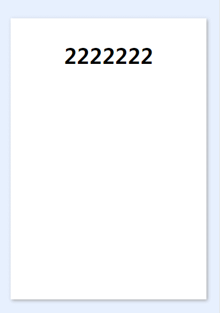

# 卡片滑动切换特效
## 可以改造为探探等卡片切换效果
- 效果图如下  

## 效果简述
- 上下左右均可移动随点击移动
- 在上下左右一定的范围内移动后会返回原来的位置，不会切换
- 只有大于一定范围才会产生切换，同时切换效果随移动方向不同，产生不同的切换效果
## 代码解析
- wxml
    - wxml里有两个卡片，相互重叠
    - 卡片绑定touch的开始，移动和结束方法，获取点击的位置
    - 绑定动画，方便之后的动画操作
- js
    - 在touch的开始方法里，绑定点击的初始位置
    - 设置卡片绝对定位，在touch移动的方法里，绑定top和left值，实现随点击点移动而移动
    - 在点击的结束方法里获取最后的点击位置，和初始位置做对比，如果x，y移动的大小在一定的范围内，则恢复绝对定位的初始值
    - 如果大于x，y设定的范围则实现切换效果
- 特效
    - 微信的js动画特效是根据css3封装而来，我当时尝试用css3实现，但结合一些动画出发要求等原因，使用微信的js东特特效还是相对方便
    - 绑定了z-index，基本实现两张卡片的相互切换
    - 模仿微信小程序文档写了动画的效果，注意的就是translate移动之后，一定要再移动回0，这样才能在之后回到卡片初始位置
    - 卡片绑定了透明度的变量，根据移动所占百分比，来显示底层的透明度
    - movebox原本分1,2。目前已经合并为一个函数，其他1,2的控制动效控制函数可以适当合并
## 后续
- 这个源码，可以在卡片内插入任意内容，相互切换
- 我自己使用的情况是去除了移动，直接切换，1、2卡片绑定的是同一个变量，由于不能移动，所以看不到下面的内容，一旦成功切换卡片，同时绑定的变量也会切换，达到了内容随卡片切换的效果
- 如果不去除移动的话，就不能1、2卡片绑定同一个变量，因为移动上面卡片会看到下面的卡片
- 解决方法1（个人思考，如果有更好的欢迎交流）
    - 绑定两个变量，切换卡片的同时，更新该卡片绑定的数据
- 解决方法2（个人思考，如果有更好的欢迎交流）    
    - 1、2卡片绑定一个数组变量，同时1、2绑定的固定的数组0位和1位数据
    - 一旦切换，则分别使用pop或shift，push或unshift进行数组变量的数据更新
    - 这样保证了数组数据切换时，卡片数据的相对固定