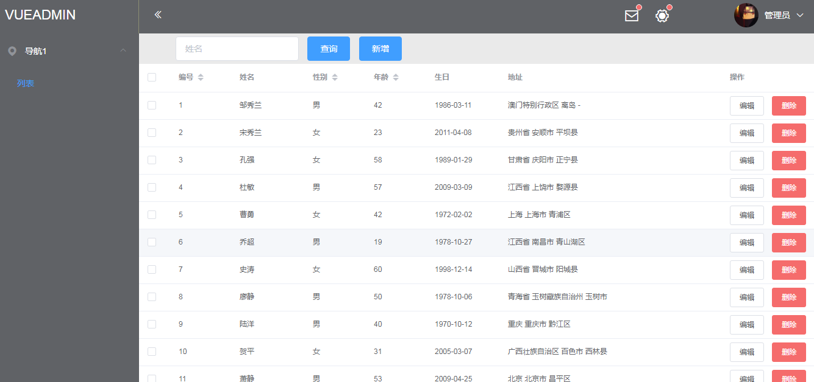

# ele-mock 后台搭建小试

### DEMO简介
- 实现功能后台管理界面简单搭建
- 登录登出功能，根据登录权限的不同，显示不同的内容
- 实现了数据的增删改查
- 目前使用的是静态路由，通过vue-router和权限达到不同权限，显示的内容不同，下一步希望改进为动态路由
- 参考众多成熟的后台源码，目前仅仅是走出自己搭建后台的第一步，还有很多不太严谨的地方，我觉得可能对和我一样搭建后台的入门者可能会有帮助，先静态路由，然后过渡到动态路由
- 使用：npm install 之后 npm run dev即可
### DEMO框架搭建
- vue
- element-ui
- vue-router
- vuex
- mock.js
### DEMO注意点
- 本项目的主要功能难点在于登录和权限
- 个人建议登录的搭建过程
    - 首先使用vue-router把路由搭建好，把router.beforeEach的限制写一部分，达到没有登录和一定权限不能访问除login以外页面的效果
    - 写登录界面，封装axios，将请求回来的mock.js的模拟身份和权限储存在vuex和localstorage
    - 此时可以进一步封装axios，使其每次访问均携带人份token
    - 之后在vue.beforeEach中读取vuex中的身份和权限，判断是否可以访问该路由
    - 页面侧边栏渲染的时候，获取路由信息，根据身份和权限，筛选可显示的路由，此为页面级控制
    - 由于每次携带token访问后台，后台可以根据token判断是否有权限进行操作，此为按钮控制级别
    - 本demo的权限使用的scope，值为数字，用户的scope大于该路由所需scope，即可访问，和其他案例中路由所需判断用户身份过程基本一样

- 动态路由的注意点
    - 之前尝试了动态路由，我执意把router.beforeEach放在router的index.js里，在动态添加路由的时候，不成功，发现会无限循环，其他的案例里好像都是放在main.js里，希望有人可以告诉我原因？
- mock.js
    - 我用之前很好奇如何达到mock.js是如何达到增删改查的，原来模拟数据在一次访问时会保存下来，将模拟数据作为数据库即可。刷新页面，模拟数据也会刷新
- 后台优秀源码资料分享
    - [简单登录入门---个人十分喜欢](https://github.com/superman66/vue-axios-github)
    - [后台源码参考一](https://blog.csdn.net/harsima/article/details/77949448)
    - [后台源码参考二](https://segmentfault.com/a/1190000009506097)
    - [后台源码参考三](https://www.cnblogs.com/taylorchen/p/6083099.html)
    - [后台源码参考四](https://github.com/lin-xin/vue-manage-system)
